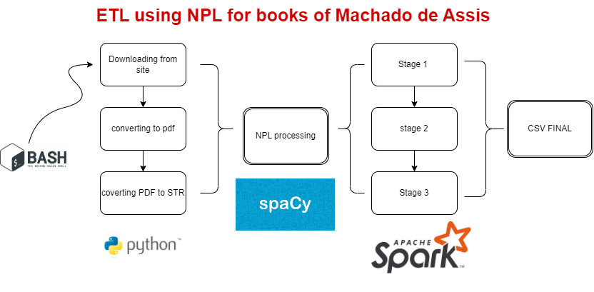

<h1 align="center">


<h3> <p align="center"> Neural Processor Language on books of Machado de Assis </p> </h3>
<h3> <p align="center"> ================= </p> </h3>

>> <h3> Solution Architecture </h3>




>> <h3> Glossary of Data </h3>

Glossary
-----------------

Fields	                                                  | Type      |    Description                              |
----------------------------------------------------------|:---------:|:-------------------------------------------:|
id                  				          | Integer   | id of data                                  |
title                                                     | String    | title of the book                           |
word                                                      | String    | the word withdrawn for analysis             |
ents                                                      | String    | Grammatical classification that refer to the analyzed words |


>> <h3> Description </h3>

<p> Machado de Assis is without a doubt the greatest Brazilian writer of all time, so how about using a little Machine Learning to analyze him?
This project consists of a fusion of ETL, big-data and Machine Learning to analyze the number of characters, places and other things most used by the writer in his works.
The first step of the project is to scrape data from the mec website (where copyright is released) addressed as machado.mec.gov.br/obra-completa-lista/
After the download is complete, a PDF to TXT conversion process begins. This process is necessary because the “spaCY” tool performs a better neuro-linguistic processing of texts in TXT extension.
After the conversion, a process of data interpretation and manipulation begins, operating the SPARK tool for this purpose. This process consists of three steps that are adjusted for a final analysis.
At the end, we have a pivot with the total count of all the characters of each work, as well as their cities and regions and other categories as you can check.
The final solution is automatically saved in a folder called DW (DataWarehouse) for further analysis.
Enjoy the project.</p>

>> <h3> How to Run </h3>

in your terminal (linux ou mac) run:

```
source start.sh

```

>> <h3> Sample of Data </h3>

```
+---+--------------+----------------+----+                                      
|id |title         |word            |ents|
+---+--------------+----------------+----+
|0  |a_mao_e_a_luva|Diógenes        |PER |
|1  |a_mao_e_a_luva|Dormiu          |LOC |
|2  |a_mao_e_a_luva|CAPÍTULO II     |MISC|
|3  |a_mao_e_a_luva|Lagrua nem Otelo|MISC|
|4  |a_mao_e_a_luva|Sir Walter      |PER |
|5  |a_mao_e_a_luva|seixo bronco    |LOC |
|6  |a_mao_e_a_luva|Dr. Luís Alves? |PER |
|7  |a_mao_e_a_luva|ma ior fortuna  |ORG |
|8  |a_mao_e_a_luva|CAPÍTULO XI     |MISC|
|9  |a_mao_e_a_luva|Diana           |PER |
|10 |a_mao_e_a_luva|Guio            |LOC |
|11 |a_mao_e_a_luva|UM ROUPÃO       |MISC|
|12 |a_mao_e_a_luva|Gu              |PER |
|13 |a_mao_e_a_luva|Hás             |PER |
|14 |a_mao_e_a_luva|go              |ORG |
|15 |a_mao_e_a_luva|Cantagalo       |LOC |
|16 |a_mao_e_a_luva|Ilíada          |MISC|
|17 |a_mao_e_a_luva|África          |LOC |
|18 |a_mao_e_a_luva|En              |MISC|
|19 |a_mao_e_a_luva|Evangelho.      |ORG |
+---+--------------+----------------+----+
only showing top 20 rows

```

>> <h3> Data analyzed </h3>

```

+-------------------------------+-------------+----------+------+------+        
|books                          |organizations|characters|places|others|
+-------------------------------+-------------+----------+------+------+
|memorias_postumas_de_bras_cubas|106          |323       |234   |281   |
|a_mao_e_a_luva                 |22           |119       |85    |77    |
|esau_e_jaco                    |71           |337       |303   |174   |
|ressurreicao                   |40           |180       |100   |110   |
|quincas_borba                  |73           |361       |349   |215   |
|memorial_de_aires              |53           |231       |218   |127   |
|iaiá_garcia                    |19           |175       |136   |95    |
|casa_velha                     |23           |141       |99    |77    |
|dom_casmurro                   |51           |314       |231   |167   |
|helena                         |53           |302       |185   |152   |
+-------------------------------+-------------+----------+------+------+

```
